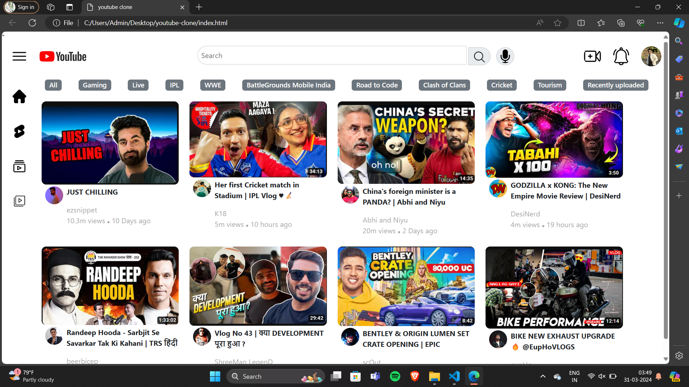

# Reciept Design🧾

**WELCOME TO YOUTUBE-CLONE DESIGN:**
This is a `open-source` project serves as an example for reciept design inspired from the YouTube `YouTube Clone` design and utilised the knowledge provided by `road to code's
course`.

whether you are an employee or a normal person youtube serves as an important aspect of any information as it serves itself as `valid proof` of any `information`.This Youtube Design can help you to have a basic idea about how YouTube is designed.

## How to contribute 

We welcome contributions from the community to help us improve this project.IF you would like to contribute,follow these steps:

1.Fork the repository to your Github account 

2.Make your changes, add new content,or fix any existing issues.

3.Open a new pull request in this repository.

